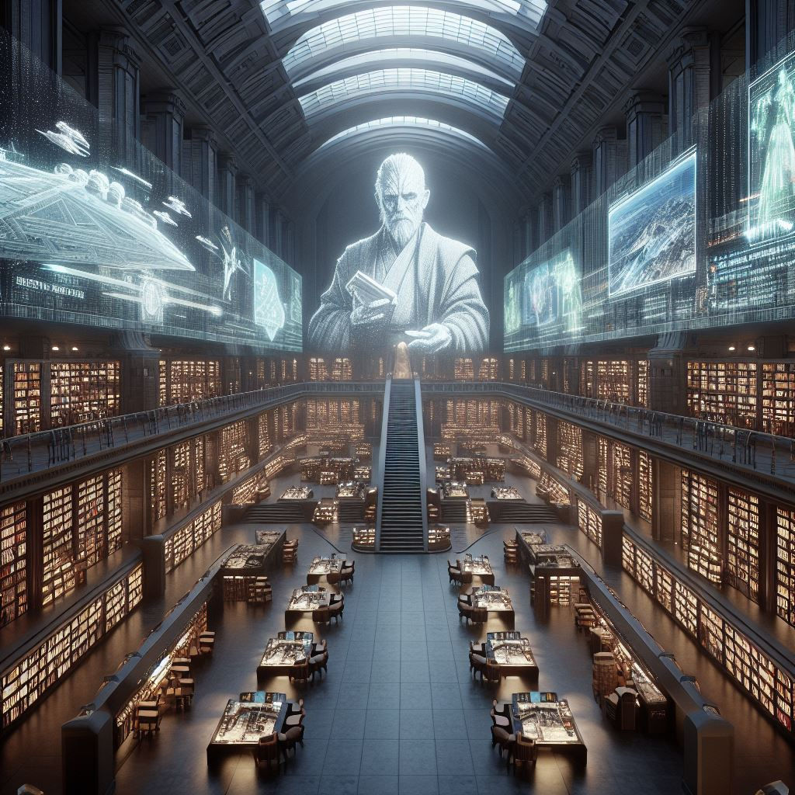
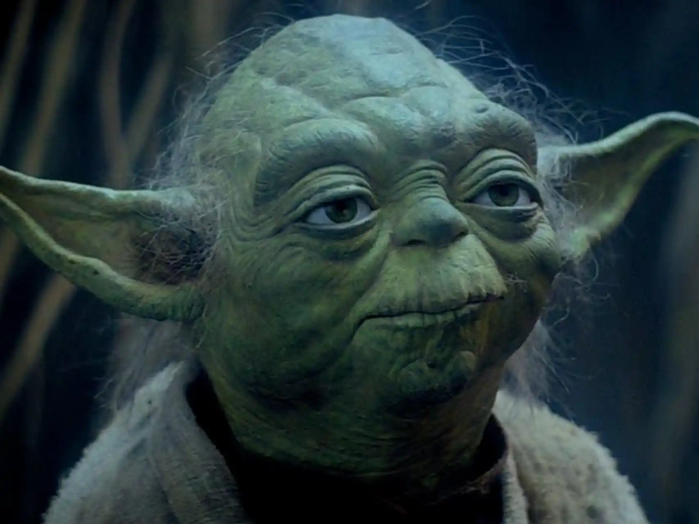

# Biblioteca Galáctica de Corusant
### APLICACIÓN DE CONSULTAS DE DOCUMENTOS MEDIANTE GPT

La biblioteca galáctica de Coruscant la más importante de la República es. En ella, saber antiguo de galaxias lejanas y cercanas se guarda. Pero insostenible se volvió la situación hace tiempo, gran afluencia de estudiosos había. Jedis de todos los planetas en busca de sabiduría venían. Los bibliotecarios miedo tuvieron. Y el miedo es el camino hacia el Lado Oscuro. El miedo lleva a la ira, la ira lleva al odio, el odio lleva al sufrimiento. 

Al Consejo Jedi, por tanto, se convocó.

Cuatro intrépidos padawans, la generación de un sistema de comunicación revolucionario les fue encomendada. Hacedlo o no lo hagáis -dijimos- pero no lo intentéis.  Midi-chlorianos usarían, la pesada carga de los Jedi bibliotecarios se aligeraría. Idea simple pero efectiva era. Cualquier ciudadano de la República, información sobre un archivo consultar podría y una sabia pregunta hacer. A través de la Fuerza, yo mismo respondería a la consulta, sin necesidad de estar presente. Además, la propia Fuerza, sin crear gran conmoción, las consultas en la nube almacenaría.

## Descripción y uso del proyecto en local

Este proyecto en una aplicación web escrita en Python con Flask consiste. Hmmm... Al ejecutarse, la web a mí me muestra. Al ciudadano introducir permite un archivo de texto y una consulta realizar. La aplicación muestra la respuesta generada por la fuerza presente en ChatGPT y, además, la consulta en Amazon AWS almacena.

Recuerda utilizar solo archivos .txt. El lado oscuro está presente en el resto. Y nada bueno trajo el lado oscuro...

Usar la aplicación en local fácil es. Basta con ejecutar el archivo 
<code>./app/app.py</code>

En tu navegador esto escribe: <code>localhost:5000</code>

Libre serás de consultarme. Pero... elige sabiamente tus preguntas. Las armas no ganan batallas. Tu mente poderosa ella es.

# Imagen de Docker

Imposible nada es. Difícil, muchas cosas son... La imagen del proyecto en Docker en esta dirección se puede encontrar:
<code>kinogalvez/grupo_4:v4</code>

Para ejecutarlo, la siguiente instrucción bastaría:

<code>docker run -p 5002:5000 kinogalvez/grupo_4:v4</code>

Recuerda el puerto que quieras escribir.

## Contenido del repositorio
El repositorio tres carpetas contiene: app, demo y notebooks, aparte de este archivo README.md.

### Archivo app

Este archivo el archivo static/img contiene. Imágenes almacena.
En el archivo templates, el poderoso html que hace de intermediario entre la fuerza está.
 
Los archivos los siguientes son:
- __app.py__: Archivo más poderoso de todos. Genera la clase Flask y la función llm que canaliza la fuerza para permitir la comunicación. La función *guardar_en_base_de_datos* guarda la consulta en una base de datos AWS. La función *index* genera la web principal, la función *query* recoge los datos del usuario, consulta a chatGPT y aplica la función *guardar_en_base_de_datos*.
- __test.py__: Aplica los tests necesarios para asegurarse de que la aplicación funciona correctamente. Comprueba la conexión, hace una consulta y almacena el resultado en la base de datos de Amazon. Transmite lo que has aprendido: fuerza, maestría; pero insensatez, debilidad, fracaso también. ¡Sí, fracaso sobre todo! El mejor profesor el fracaso es. 
- __Dockerfile__: Archivo necesario para crear la imagen de Docker del proyecto que se puede buscar como kinogalvez/grupo_4:v4
- __requirements.txt__: Bibliotecas necesarias para utilizar el proyecto. Caminos a la victoria hay, distintos que aplastar a un enemigo.

### Archivo demo
Contiene unos txt para hacer pruebas.

### Archivo notebooks
Archivos intermedios usados para generar el proyecto. Grande la fuerza es en el archivo __matias.ipynb__. En el apartado *Consultar tabla* comprobar se puede el contenido actual de la base de datos AWS.

# Autores

- Padawan Álex Campos
- Padawan Joaquín Gálvez
- Padawan Matías Ibarra
- Padawan Raimundo Sieso
